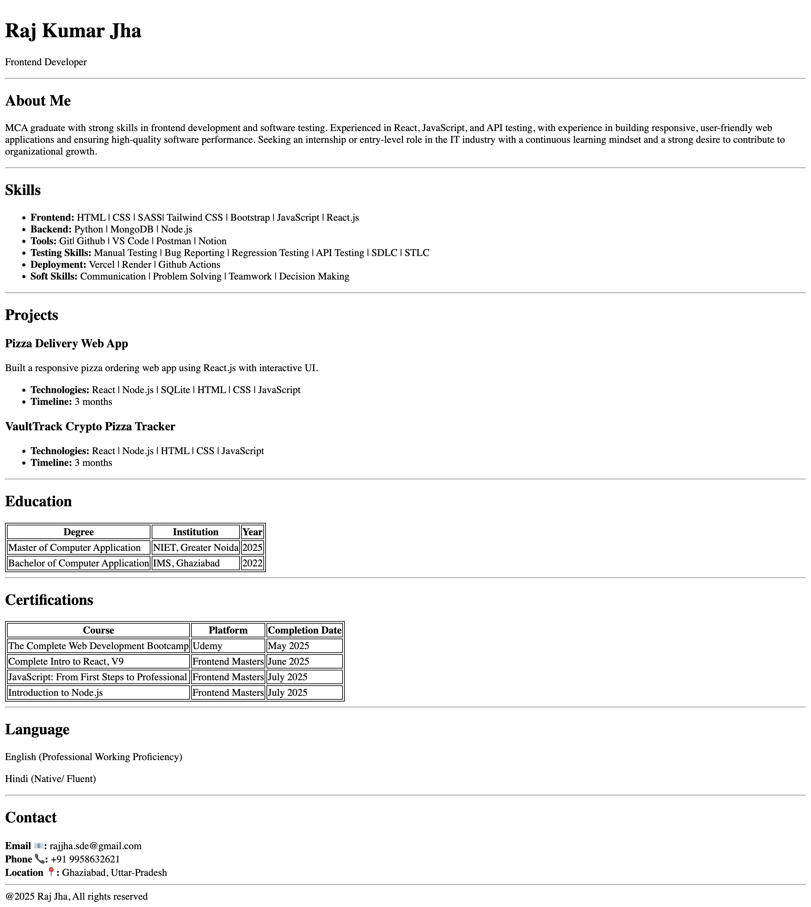

# Personal Resume Website

HTML Resume Page Assignment built using HTML and CSS.

## Live Demo

(Add your deployed link here)

## 📸 Screenshots



## 📂 Project Structure

.
├── index.html
├── README.md
└── screenshots
└── home.png

## ⚙️ Setup Steps

## ⚙️ Setup Steps

1. Create a project folder using terminal:

```bash
   mkdir HtmlResumePageAssignment
   cd HtmlResumePageAssignment
```

2. Open the project folder in VS code.

```bash
   code .
```

3. Create index.html file inside the main directory.

4. Open index.html and click Go Live (Live Server) in VS Code.

5. The project will open in your default browser

💡 Usage
• View personal profile
• Check skills and education
• Review certifications
• Contact information available

🛠️ Technologies Used
• HTML5
• CSS3

👨‍💻 Author
Raj Kumar Jha
